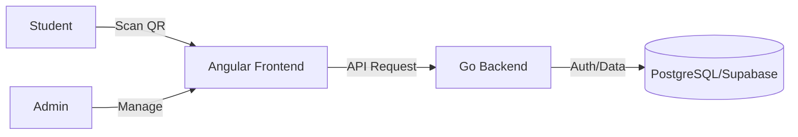

# 🚀 QR Check-In

**Simplify activity attendance with a single scan.**

No more paper lists. No more manual entry. Just a QR code, a quick scan, and you're checked in. Fast, secure, and effortless.

---

## 🌟 The Concept

`Activity` $\rightarrow$ `QR Code` $\rightarrow$ `Student Scan` $\rightarrow$ `Instant Check-In`

This system provides a seamless bridge between event organizers and participants, replacing tedious manual attendance tracking with a modern, automated workflow.

## ✨ Key Features

- **⚡ Instant Check-In**: Students scan a dynamic QR code to register their presence instantly.
- **🛠️ Admin Command Center**: Full-featured dashboard to create, manage, and monitor activities.
- **📲 QR Engine**: Backend-generated QR codes for every activity, ensuring secure and unique check-in points.
- **🔒 Secure Auth**: Integrated with Supabase for robust authentication and identity management.
- **🐳 One-Command Deploy**: Fully dockerized environment for instant setup.

## 🛠️ Tech Stack

| Layer | Technology | Description |
| :--- | :--- | :--- |
| **Frontend** |  | Modern SPA for Admin & Student interfaces. |
| **Backend** |  | High-performance API built with Gin & GORM. |
| **Database** |  | Relational storage managed via Supabase. |
| **DevOps** |  | Containerized orchestration for consistent environments. |

## 🚀 Quick Start

### Prerequisites
- Docker & Docker Compose

### Installation
1. **Clone the repo**
   ```bash
   git clone https://github.com/Teeraphat2104/QR-Check-In.git
   cd QR-Check-In
   ```

2. **Configure Environment**
   Copy `.env.example` to `backend/.env` and fill in your Supabase credentials.
   ```bash
   cp backend/.env.example backend/.env
   ```

3. **Launch**
   ```bash
   docker compose up --build -d
   ```

4. **Access**
   - Frontend: `http://localhost:8081`
   - Backend API: `http://localhost:8081` (served via Go)

## 📐 Architecture



---
Developed with ⚡ by [Teeraphat2104](https://github.com/Teeraphat2104)
